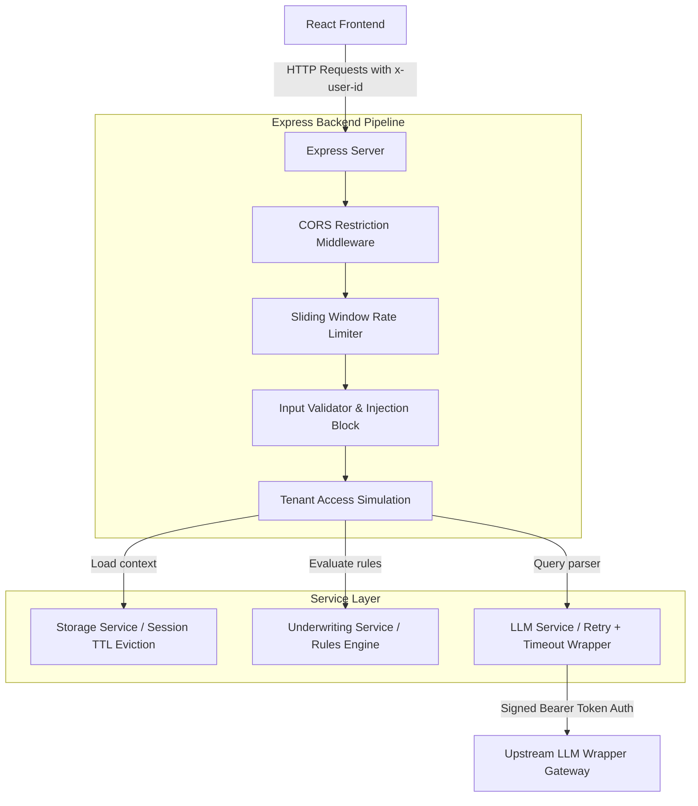

# LendSafe AI - Document Parsing & Underwriting Decision Automation

LendSafe AI is an automated document intelligence and underwriting audit platform. It allows lending teams to upload or select financial documents (salary slips, bank statements), extract critical metrics using LLMs, execute decision rules, and perform grounded audit checks via chat.

The code has been refactored and hardened for production, resolving critical vulnerabilities (hardcoded secrets, wildcard CORS), adding input validation, preventing unbounded memory leaks, implementing structured logging, achieving keyboard and ARIA compliance, and adding a comprehensive unit testing suite.

---

## System Architecture

The following Mermaid diagram shows the flow of requests from the React client, through the middleware filters, to the backend service layer and upstream LLM wrapper.



---

## Technical Stack

* **Frontend**: React (Vite, JS) with Vanilla CSS (premium dark glassmorphism design, responsive layouts, full ARIA and keyboard navigation compliance).
* **Backend**: Node.js + Express (modular service architecture, ESM modules, zero external database setup required, native test runner).

---

## API Reference

All requests to `/api/*` endpoints (except `/api/documents`) require an `x-user-id` header to identify the tenant session context.

### 1. Preloaded Mock Documents
* **Endpoint**: `GET /api/documents`
* **Description**: Returns metadata for standard assessment demo files.
* **Payload**: None.
* **Response**:
  ```json
  [
    { "id": "healthy_payslip", "name": "Salary Slip - Alice (Healthy)", "type": "Salary Slip" },
    { "id": "high_dti_statement", "name": "Bank Statement - Bob (High DTI)", "type": "Bank Statement" }
  ]
  ```

### 2. Get Active Session
* **Endpoint**: `GET /api/session/active`
* **Description**: Fetches current tenant document, extraction status, underwriting results, and conversation history.
* **Headers**: `x-user-id: <string>`
* **Response**:
  ```json
  {
    "userId": "user_123",
    "activeDocument": { "id": "healthy_payslip", "name": "Salary Slip - Alice (Healthy)", "type": "Salary Slip" },
    "extraction": null,
    "underwritingResult": null,
    "chatHistory": []
  }
  ```

### 3. Load Document into Session
* **Endpoint**: `POST /api/document/select`
* **Description**: Selects a preloaded mock document, uploads custom text, or loads base64 document files into the active session.
* **Headers**: `x-user-id: <string>`
* **Payload**:
  * Pass `documentId` to load a preloaded mock document: `{ "documentId": "healthy_payslip" }`
  * Pass `fileBase64` to load files: `{ "fileBase64": "data:image/png;base64,...", "documentName": "doc.png", "documentType": "Salary Slip", "fileType": "image/png" }`
  * Pass `customText`: `{ "customText": "Employer: ACME Inc...", "documentName": "Custom text" }`
* **Response**:
  ```json
  {
    "success": true,
    "message": "Document loaded into session.",
    "document": { "id": "uploaded_1781234123", "name": "doc.png", "type": "Salary Slip" }
  }
  ```

### 4. Parse Document
* **Endpoint**: `POST /api/document/parse`
* **Description**: Formulates prompts, runs OCR via LLM, and formats metrics into a structured JSON extraction profile.
* **Headers**: `x-user-id: <string>`
* **Response**:
  ```json
  {
    "success": true,
    "extraction": {
      "accountHolderName": "Alice Smith",
      "employer": "TechCorp",
      "monthlyIncome": 6000,
      "deductions": 500,
      "averageBankBalance": 0,
      "existingEMI": 800,
      "bouncedTransactions": 0,
      "documentType": "Salary Slip",
      "currency": "$",
      "confidenceScores": { "monthlyIncome": 0.95 },
      "evidence": { "monthlyIncome": "Net monthly pay: $6,000" }
    }
  }
  ```

### 5. Run Underwriting Check
* **Endpoint**: `POST /api/document/underwrite`
* **Description**: Runs the deterministic underwriting rules engine on the session's parsed profile.
* **Headers**: `x-user-id: <string>`
* **Response**:
  ```json
  {
    "success": true,
    "underwritingResult": {
      "decision": "Approve",
      "reasons": ["All underwriting rules satisfied with healthy financial margins."],
      "rules": [
        { "name": "Minimum Net Income Check", "description": "...", "status": "PASS", "critical": true }
      ],
      "analyzedAt": "2026-06-17T17:30:00.000Z"
    }
  }
  ```

### 6. Grounded Chat
* **Endpoint**: `POST /api/chat`
* **Description**: Q&A endpoint grounded strictly on the active document and decision results to prevent LLM hallucinations.
* **Headers**: `x-user-id: <string>`
* **Payload**: `{ "question": "What is the applicant's DTI ratio?" }`
* **Response**:
  ```json
  {
    "reply": "The applicant's DTI (FOIR) ratio is calculated at 13.3%, which satisfies the maximum limit of 40%.",
    "chatHistory": [
      { "role": "user", "content": "What is the applicant's DTI ratio?" },
      { "role": "assistant", "content": "..." }
    ]
  }
  ```

---

## Security & Reliability Profile

1. **Secret Management**: Removed all hardcoded Bearer tokens from code. Configured environment lookup for `LLM_WRAPPER_TOKEN`.
2. **CORS Control**: Restricts requests strictly to allowed origins list (`ALLOWED_ORIGINS` in env), preventing arbitrary domain hijacks.
3. **Tenant Access Check**: Verifies `x-user-id` header presence and forces Alphanumeric regex verification (`/^[a-zA-Z0-9_-]+$/`) to prevent header injection.
4. **Input Length Verification**: Max caps uploaded text to 100KB, base64 payloads to 8MB, and questions to 500 characters.
5. **Prompt Injection Filters**: Blocks queries attempting context escapes (e.g. *"ignore previous instructions"*).
6. **Rate Limiting**: Sliding-window limiter caps tenants to 60 requests/minute.
7. **Session Expiry**: An active TTL monitor runs every 5 minutes to evict inactive sessions older than 30 minutes, resolving the unbounded memory growth issue.
8. **Fault Tolerance**: Upstream queries utilize a 20-second timeout to prevent request hanging, and implement exponential backoff retry (up to 3 times) for transient 502/503/504 gateway failures.

---

## Underwriting Rules Engine

1. **Minimum Income Check**: Checks net monthly income is $\ge$ minimum limit ($\ge \$2,000$ or $\ge \text{₹}20,000$ dynamically based on detected document currency).
2. **FOIR / Debt-to-Income**: Debt payments must not exceed 40% of net income.
3. **Average Balance Check**: Checks average bank balance covers at least $2 \times$ existing EMIs (applies to Bank Statements with active EMIs).
4. **Repayment Cleanliness**: Must have zero bounced or NSF transactions.

### Decision Workflow
* **Reject**: Any critical check (Income, FOIR, Bounces) fails.
* **Manual Review**: Triggers if:
  * Any field extraction confidence score $< 0.8$.
  * Non-critical check fails (Average Balance check).
  * Borderline FOIR (between 35% and 40%).
  * Borderline Income (within $\$500$ or $\text{₹}5,000$ above minimum).
* **Approve**: All checks pass with healthy margins.

---

## Verification & Testing

### Running Unit Tests
We use Node.js's native test runner to verify the underwriting engine without external test runner bloat.

To execute tests:
```bash
cd backend
npm test
```

### Manual Verification
* To verify the rate limiter, trigger rapid requests on any endpoint.
* Check session clean-up logs in standard stdout output.
* Verify frontend builds cleanly.

### Docker Deployment
We provide a containerized setup to launch both services together locally:
1. Make sure your environment variables (like `LLM_WRAPPER_TOKEN`) are configured.
2. Build and launch services using Docker Compose:
   ```bash
   docker compose up --build
   ```
This will launch the backend on port `5000` and the frontend Nginx web server on port `5173`.

### CI/CD Workflow
A GitHub Actions workflow is configured in `.github/workflows/ci.yml`. It runs automated backend tests on every push and pull request to the `main` branch.

---

*Made with ❤️ by Ankit*
